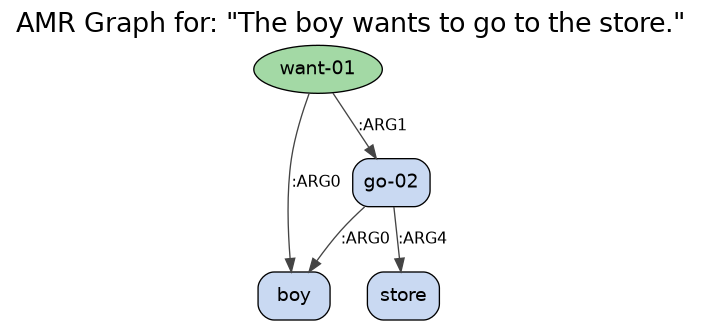

# AMR-Parsing-Summarization: A Graph-to-Text Framework

This repository contains a modular, configurable implementation of the abstractive text summarization framework presented in the paper: **"Text summarization based on semantic graphs: an abstract meaning representation graph-to-text deep learning approach"** (Kouris et al., 2024).

The project provides a pipeline for generating abstractive summaries by first parsing text into Abstract Meaning Representation (AMR) graphs, and then using a deep learning model to generate a summary directly from this semantic representation.


*(Example of a styled AMR graph generated by this project)*

---

## Project Structure

The framework is organized into a modular structure for clarity and extensibility:

```
AMR-Parsing-Summarization/
│
├── config/
│   └── config.py           # Central configuration for paths, models, and hyperparameters
│
├── data/
│   ├── data_loader.py      # Handles data loading, AMR parsing, and graph transformations
│   └── train.csv           # (Example) Training data
│
├── models/
│   ├── as2sp.py            # Attentive Sequence-to-Sequence with Pointer-Generator
│   ├── trce.py             # Transformer with (frozen) Contextual Embeddings
│   ├── petr.py             # Pre-trained Encoder Transformer (fine-tuned)
│   └── rl.py               # Reinforcement Learning (self-critical) components
│
├── main.py                 # Main entry point to run training or generation
├── train.py                # Unified training script
├── generate.py             # Script to generate summaries with a trained model
└── README.md               # This file
```

---

## Features

*   **Multiple Models**: Implements several models from the paper: `AS2SP`, `TRCE`, `PETR`, and an `RL` training scheme.
*   **Configurable Pipeline**: Easily switch between models, data schemes, and hyperparameters via a central config file.
*   **All Data Schemes**: Supports all graph construction (`sequence`, `combination`) and transformation (`OAMR`, `OAMRWS`, `SAMR`, `SAMRWS`) methods described in the paper.
*   **Modular and Extensible**: The clean structure makes it easy to add new models, datasets, or evaluation metrics.

---

## Setup and Installation

#### 1. Clone the Repository
```bash
git clone https://github.com/MasihMoafi/AMR-Parsing-Summarization.git
cd AMR-Parsing-Summarization
```

#### 2. Environment and Dependencies
A Conda environment is recommended.
```bash
# Create and activate the environment
conda create -n amr_env python=3.10
conda activate amr_env

# Install dependencies using uv (or pip)
pip install uv
uv pip install torch pandas amrlib==0.8.0 penman==1.3.1 transformers tqdm
```

#### 3. System-level Dependencies
The `graphviz` library requires a system-level installation.
-   **Ubuntu/Debian**: `sudo apt-get update && sudo apt-get install graphviz -y`
-   **macOS (Homebrew)**: `brew install graphviz`

#### 4. Download AMR Parser Model
Download the pre-trained AMR parsing model (`model_parse_xfm_bart_large-v0_1_0.tar.gz`) and place it in the project root. Then, extract it.
```bash
# In the project root directory
tar -xzvf model_parse_xfm_bart_large-v0_1_0.tar.gz
```

#### 5. Configure Paths
Open `config/config.py` and ensure all paths (e.g., `DATA_PATH`, `MODEL_PATH`) are correctly set for your system.

---

## How to Run

Use the main entry point `main.py` to either train a model or generate a summary.

### Training
To train a model, specify the `train` mode. You can override any setting from the config file using command-line arguments.

```bash
# Train the model specified in the config file (e.g., AS2SP)
python main.py train

# Train a different model, for example, PETR
python main.py train --model PETR
```
The script will use the settings in `config/config.py` to load the correct data, build the model, and start the training process.

### Generation
To generate a summary with a trained model, specify the `generate` mode. You must provide the input text and the path to your saved model.

```bash
# Example of generating a summary
python main.py generate \
    --model AS2SP \
    --model_path "path/to/your/saved_model.pt" \
    --text "The boy wants to go to the store and buy some food."
```

---

## License
This project is licensed under the MIT License.